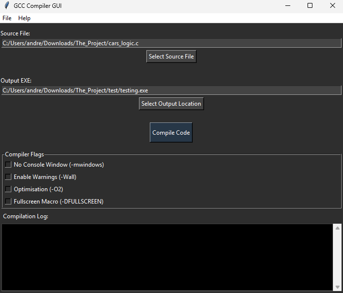
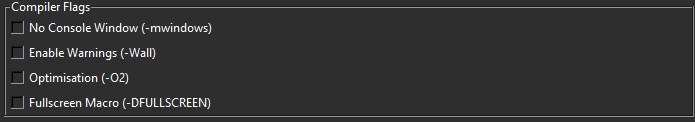
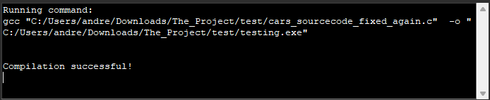
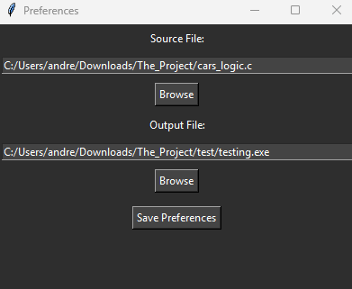

# GCC Compiler GUI

GCC Compiler GUI is a simple, Windows-focused graphical interface for compiling C and C++ programs using GCC. It removes the need to manually write compiler commands by providing an easy-to-use GUI with common compiler options built in.

You can select a source file, choose where the output executable should be saved, enable common GCC flags, and compile your code with a single click. The app displays the full compilation output and errors in a live log window, making it easy to debug issues without leaving the interface.

The download is only but a .exe, which you can download from [HERE.](https://github.com/ToxicityOfOurCity/simple-gcc-compiler/releases/tag/release)

---

# Features

Compile C and C++ source files using GCC

Select source files and output executables via file dialogs

Toggle common compiler flags:

- mwindows (no console window)

- Wall (enable warnings)

- O2 (optimisation)

- DFULLSCREEN (custom macro support)

Live compilation log with stdout and error output

Background compilation (UI stays responsive)

Preferences saved automatically using a config file

Simple dark-themed Tkinter interface

Designed for Windows GCC workflows (MinGW / similar)

---

# How it works

Select a C or C++ source file.

Choose where the output .exe should be saved.

Enable any compiler flags you want.

Click Compile Code and view the results in the log window.

This tool is intended for learning, educational use, and small projects, especially for users who prefer a GUI over the command line. Originally this was made during my school hours for the simple reason that the last users completely broke every IDE for the C language, so i had to improvise and used this python code to make an app, instead of just using the terminal.

---

# IMAGES 

The full window and GUI of the App.

Current supported flags for compilation ( I'm aware they're not many. )

Compiler logs from the app when i used a test .c programm to compile into an .exe

The Preferences tab, where people can save their input/output dirs using a config.JSON saved in the app-data.
